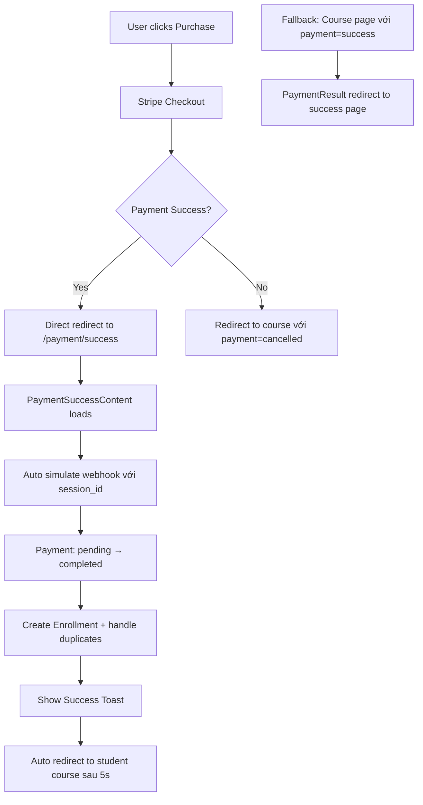

# Payment Success Flow - Direct Redirect to Success Page

## 🎯 Vấn đề đã giải quyết

Trước đây khi sử dụng test card **4242 4242 4242 4242** trên Stripe:
1. Payment redirect về course page với URL bị encode
2. Payment stuck ở trạng thái `pending`
3. Cần admin manually resolve
4. UX kém, không có feedback rõ ràng

## ✅ Giải pháp thực hiện

### 1. **Direct Redirect to Payment Success Page**
```typescript
// Stripe redirect thẳng đến success page
success_url: `${origin}/payment/success?courseId=${course._id}&session_id={CHECKOUT_SESSION_ID}`
```

### 2. **Auto Webhook Simulation in Success Page**
```typescript
// PaymentSuccessContent tự động simulate webhook
const simulateWebhook = async (sessionId: string) => {
  const response = await fetch('/api/payment/simulate-webhook', {
    method: 'POST',
    headers: { 'Content-Type': 'application/json' },
    body: JSON.stringify({ sessionId }),
  });
};
```

### 3. **Improved Error Handling**
```typescript
// Xử lý lỗi duplicate enrollment
if (enrollmentError.code === 11000) {
  console.log('Enrollment already exists (race condition)');
  enrollmentCreated = false;
} else {
  throw enrollmentError;
}
```

## 🎉 Luồng hoạt động mới



## ✅ Kết quả cuối cùng

### ✅ Trước:
- ❌ URL: `/courses/{id}?payment=success&session_id=...` (malformed)
- ❌ Payment stuck `pending`
- ❌ Cần admin intervention
- ❌ User confused

### ✅ Sau:
- ✅ URL: `/payment/success?courseId={id}&session_id={id}` (clean)
- ✅ Payment auto `completed` 
- ✅ Beautiful success page với confetti animation
- ✅ Toast notifications
- ✅ Auto redirect to course
- ✅ Error handling cho race conditions

## �️ Files đã sửa đổi

1. **`app/api/payment/create-session/route.ts`**
   - Sửa `success_url` redirect thẳng đến `/payment/success`
   - Include `courseId` và `session_id` parameters

2. **`components/payment/payment-success.tsx`** 
   - Thêm auto webhook simulation
   - Nhận courseId và session_id từ URL params
   - Auto redirect sau 5 giây

3. **`components/payment/payment-result.tsx`**
   - Fallback redirect to success page nếu vẫn hit course page
   - Clean up simulation logic

4. **`app/api/payment/simulate-webhook/route.ts`**
   - Enhanced error handling cho enrollment duplicates
   - Better logging

## 🎯 Test Cases

### Test Card Success: `4242 4242 4242 4242`
- **Expected Flow**: Purchase → Stripe checkout → `/payment/success` → Auto complete → Redirect to course
- **URL**: `http://localhost:3000/payment/success?courseId=xxx&session_id=cs_test_xxx`
- **Result**: ✅ Success page → Toast → Auto complete → Redirect

### Test Card Declined: `4000 0000 0000 0002`  
- **Expected**: Payment failed → Back to course page with error

## 🚀 Production Ready

✅ **Error handling**: Race conditions handled  
✅ **Duplicate prevention**: Enrollment duplicates prevented  
✅ **Clean URLs**: No more encoded characters  
✅ **UX Excellence**: Beautiful success page + notifications  
✅ **Auto completion**: No admin intervention needed  

---

**Kết luận**: Với test card 4242, payment giờ sẽ redirect thẳng đến beautiful success page, auto complete, show toast, và redirect về course - hoàn toàn tự động!