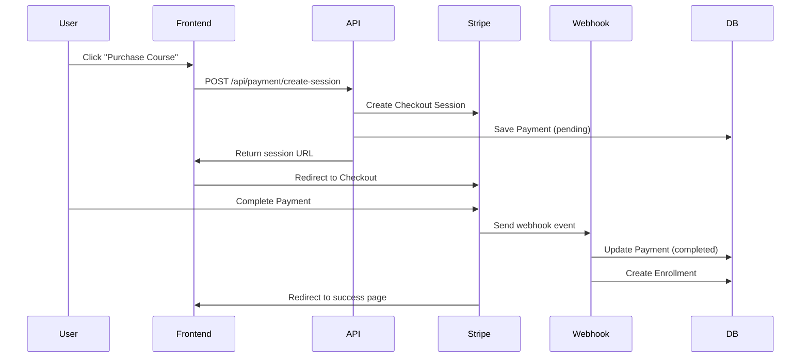

# Payment System Documentation

## Overview
Complete Stripe integration for course purchases with webhook handling and payment history.

## Features

### ✅ Completed
- **Stripe Checkout Integration**: Secure payment processing
- **Webhook Handling**: Automatic enrollment after successful payment
- **Payment History**: Complete transaction tracking
- **Course Access Control**: Check enrollment and payment status
- **UI Components**: Ready-to-use payment buttons and status displays
- **Error Handling**: Comprehensive error management
- **Test Mode**: Safe testing environment

## API Endpoints

### 1. Create Payment Session
```
POST /api/payment/create-session
```
**Body:**
```json
{
  "courseId": "course-id",
  "userId": "user-id"
}
```
**Response:**
```json
{
  "sessionId": "cs_session_id",
  "url": "https://checkout.stripe.com/pay/...",
  "paymentId": "payment-record-id"
}
```

### 2. Payment Webhook
```
POST /api/payment/webhook
```
Handles Stripe webhooks for payment completion and creates enrollments.

### 3. Payment History
```
GET /api/payment/history
```
Returns user's payment history with course details.

### 4. Check Course Access
```
GET /api/payment/check-access?courseId=xxx
```
**Response:**
```json
{
  "isEnrolled": true,
  "hasPaid": true,
  "hasPendingPayment": false,
  "enrollmentStatus": "active",
  "paymentId": "payment-id"
}
```

## Components

### PurchaseCourseButton
```tsx
<PurchaseCourseButton 
  course={{
    _id: "course-id",
    title: "Course Title",
    price: 99.99,
    slug: "course-slug"
  }}
  isEnrolled={false}
/>
```

### PaymentStatus
```tsx
<PaymentStatus 
  courseId="course-id" 
  onStatusChange={(status) => console.log(status)} 
/>
```

### PaymentHistory
```tsx
<PaymentHistory />
```

### PaymentResult
```tsx
<PaymentResult 
  onSuccess={() => console.log('Payment successful')}
  onError={() => console.log('Payment failed')}
/>
```

## Database Models

### Payment Model
```typescript
{
  stripeSessionId: string;
  userId: ObjectId;
  courseId: ObjectId;
  amount: number; // in cents
  currency: string;
  status: 'pending' | 'completed' | 'failed' | 'cancelled' | 'refunded';
  metadata: object;
  createdAt: Date;
  completedAt: Date;
}
```

## Setup Instructions

### 1. Environment Variables
Copy `.env.example` to `.env.local` and fill in your Stripe keys:
```env
STRIPE_PUBLISHABLE_KEY=pk_test_...
STRIPE_SECRET_KEY=sk_test_...
STRIPE_WEBHOOK_SECRET=whsec_...
```

### 2. Stripe Webhook Setup
1. Go to Stripe Dashboard > Webhooks
2. Add endpoint: `https://yourdomain.com/api/payment/webhook`
3. Select events: `checkout.session.completed`, `checkout.session.expired`
4. Copy webhook secret to `STRIPE_WEBHOOK_SECRET`

### 3. Course Price Setup
Ensure your Course model has a `price` field:
```typescript
{
  price: { 
    type: Number, 
    default: 0,
    min: [0, 'Price cannot be negative']
  }
}
```

## Testing

### Test Cards (Stripe Test Mode)
- **Success**: 4242 4242 4242 4242
- **Decline**: 4000 0000 0000 0002
- **Insufficient funds**: 4000 0000 0000 9995

Use any future expiry date and any 3-digit CVC.

### Demo Page
Visit `/payment-demo` to test the complete payment flow.

## Security Features

- ✅ Webhook signature verification
- ✅ Authentication required for all payment APIs
- ✅ Server-side payment validation
- ✅ Secure token handling
- ✅ Input validation and sanitization

## Error Handling

- Network failures with retry logic
- Stripe API errors with user-friendly messages
- Database errors with fallback responses
- Invalid input validation
- Authentication errors

## Payment Flow



## Future Enhancements

- [ ] Subscription payments
- [ ] Refund handling
- [ ] Multiple payment methods
- [ ] Payment analytics dashboard
- [ ] Coupon/discount codes
- [ ] Multi-currency support

## Troubleshooting

### Common Issues

1. **Webhook not working**: Check endpoint URL and secret
2. **Payment not completing**: Verify webhook events are selected
3. **Duplicate payments**: Check for double-click prevention
4. **Access not granted**: Verify enrollment creation in webhook

### Debug Mode
Set `NODE_ENV=development` to see detailed error logs.